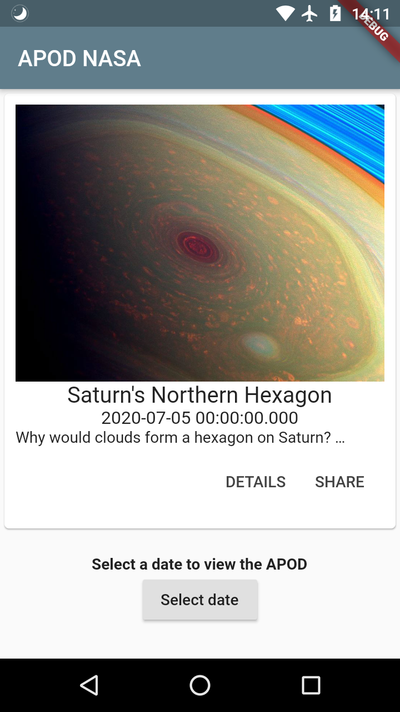
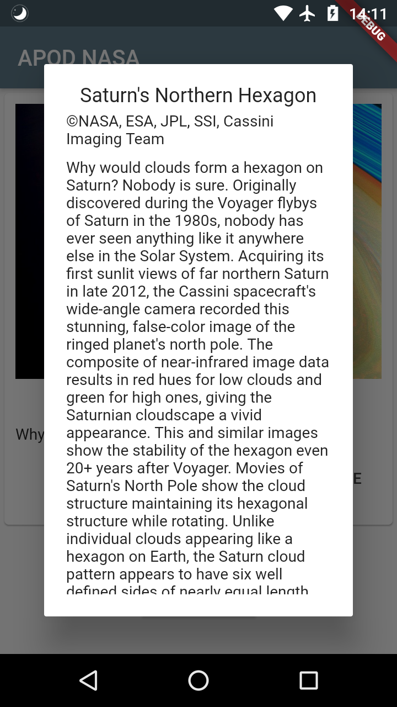

# flutter-nasa-apod
<<<<<<< HEAD
A simple Flutter App to admire photos of NASA's Astronomy Picture of the Day

## Screenshots

  

 

  

||||||| merged common ancestors
A simple Flutter App to admire photos of NASA's Astronomy Picture of the Day
=======
A simple Flutter App to photos of NASA's Astronomy Picture of the Day.

## Screenshots

  

 

  

>>>>>>> 5d2ac2d4853dafd2eb0043441913723f278770ad
